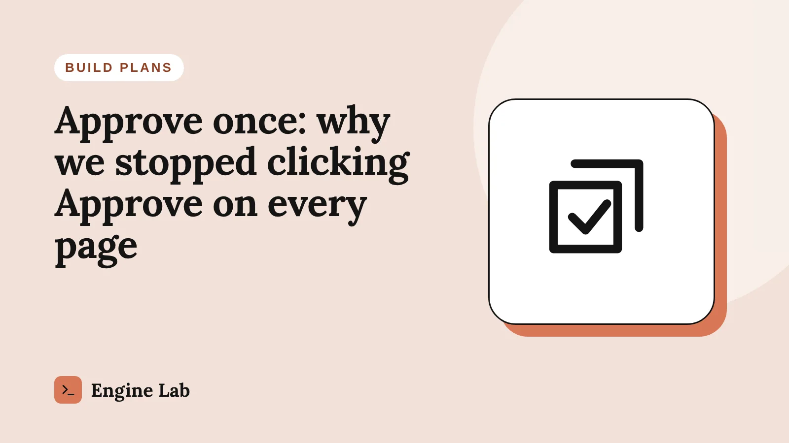

# FB AI Engine – Claude Connector

Connect **Claude** to your **WordPress** site as a custom connector (a remote MCP server with OAuth sign-in) and let it build and maintain the site for you — while you stay in charge.

> It proposes. You approve. Then it acts.



- **Approve once** — agree the mockups in chat, approve one *build plan*, and Claude builds the whole site: pages, blog posts, theme, menu and homepage.
- **Watch Me Live** — follow every step on your own site, with a live view of the page Claude is changing. Also: see **Claude's own browser** live when it works on admin screens, and hear **spoken briefs** (English or Türkçe).
- **Starts from a blank site** — on a fresh WordPress install Claude installs the theme and plugins the approved plan lists (free ones from WordPress.org), clears the default content and builds everything.
- **Checks its own work** — takes a WPvivid backup before building and runs a site check (broken links, missing images, stale CDN copies) before calling a job done.
- **English or Türkçe** — every connector screen in either language.
- **Safe by design** — its own Editor user, permission levels, an approval queue, a revision before every edit, an activity log and a kill switch.

Live demo and docs: the **Engine Lab** test site was built entirely through this connector — one backup, one approval, then Claude built the rest.

---

## Requirements

- WordPress 6.4 or newer, PHP 7.4 or newer, HTTPS
- An administrator account
- A Claude plan that supports custom connectors

## Install

1. **Back up your site first** (for example with WPvivid).
2. Download **fb-claude-connector-1.2.1.zip** from the [latest release](https://github.com/fatihborasoftware-sudo/fb-claude-connector/releases/latest) (or from [`dist/`](dist/fb-claude-connector-1.2.1.zip)).
3. In WordPress go to **Plugins → Add New → Upload Plugin**, choose the zip and activate it. A new screen appears: **Claude Connection**.
4. Open **Claude Connection → Setup**, click **Run server check**, then **Run full test**. It should report `initialize: 200` and the number of tools.

> Do not use GitHub's green *Code → Download ZIP* button to install — that zip contains the whole repository. Use the file in `dist/`, or zip the `plugin/fb-claude-connector` folder yourself.

## Connect Claude

1. In Claude open **Settings → Connectors → Add custom connector**.
2. Paste the **full endpoint address** shown on Claude Connection → Overview:
   `https://your-site.com/wp-json/fbsa/v1/mcp`
3. Click **Connect**. Your site asks *Connect Claude to this site?* — check the permission level and click **Allow Claude**.
4. Start a **new chat** and ask: *"Run site_health on my site."*

Claude never sees your password. It receives a key you can revoke at any time.

### Common problems

| What you see | Cause | Fix |
|---|---|---|
| “Authorized, but returned an error when connecting” | The connector URL is the site's home page | Add it again with the full `/wp-json/fbsa/v1/mcp` address |
| Same error, URL is correct | Your host drops the `Authorization` header | Setup → Run server check → apply the `.htaccess` fix |
| New tools do not appear | A chat keeps the tool list it started with | Start a new chat |

## Permission levels

| Level | Claude can | Needs your approval |
|---|---|---|
| **Read-only** (default) | Read pages, posts, plugins, images, backups and site health | — |
| **Content editor** | Create and edit drafts, upload images, set featured images and categories | Editing live pages, publishing, menus, homepage, theme and CSS |
| **Site maintainer** | Everything above, plus plugin installs and updates | Plugin installs and updates (blocked while the lab lock is on) |

A **build plan** replaces the separate approvals for everything it lists. Anything outside the plan still asks.

## Tools (1.2.1)

**Read:** `site_health`, `site_check`, `content_list`, `content_get`, `plugins_list`, `media_list`, `backup_status`, `theme_settings_get`, `activity_recent`, `approvals_list`, `build_plan_status`, `task_status`

**Write:** `backup_create`, `content_create_draft`, `content_update`, `content_publish`, `content_trash`, `media_upload`, `media_upload_data`, `post_settings_set`, `menu_set`, `site_settings`, `build_plan_submit`

**Theme (approval or build plan):** `theme_settings_set`, `widgets_set`, `custom_css_set`

**Plugins & themes (Site maintainer):** `plugins_install`, `plugins_update`, `theme_install`

**With other plugins:** `form_create` (Contact Form 7), `mindmap_list`, `mindmap_get`, `mindmap_update` (FB Mind Map)

## Watch Me Live

**Claude Connection → ▶ Watch Claude live** shows, in real time:

- the current step and the whole plan, reported by Claude with `task_status`
- your site at full size — still clickable — with Claude's changes outlined in orange
- **Claude's browser**: when Claude must use a screen no tool covers, it first opens *Link Claude's browser* and clicks **Link**. Watch Me Live then mirrors that browser: the page it is on, an orange marker on what it clicked, and a view-only copy of the screen. Only the linked browser reports; scripts, passwords, hidden fields and nonces are never copied. The link ends when the task is done, when you click Unlink, or after 2 hours.
- **Voice briefs**: a start brief, each step, *waiting for you* and a finish brief, read aloud by your browser. Choose what to read, English or Türkçe, the voice and the speed.
- a **working indicator**: moving dots, what Claude is doing right now and a running clock — plus an orange glow around your site while Claude works
- a side panel you can **resize** by dragging its edge or **minimize** into a slim rail (» button or the `]` key), and a **Light / Dark / Auto** theme
- approvals you can approve or reject in place, and a full activity feed.

## Build a site from a blank WordPress

1. Install WordPress and this plugin. If Claude Connection shows *Fix your links first*, click **Use post-name links**.
2. Setup → **Run server check**, set the level to **Site maintainer**, connect Claude.
3. Agree the mockups with Claude in chat. Claude sends **one build plan** that lists the pages, blog posts, theme, plugins and the default content to move to the Trash.
4. Approve the plan once. Claude installs WPvivid and takes a backup, installs the theme and plugins, clears *Hello world!*, uploads the images and builds every page — you follow along on Watch Me Live.

Only free plugins and themes from WordPress.org can be installed this way.

A complete worked example — the mockup, the prompts and the build kit for an 8-page clinic site — is in [`examples/nova/`](examples/nova/):

[](examples/nova/)

## Safety

1. **Its own user** — Claude acts as `claude-agent` (Editor), never as you; that user cannot sign in with a password.
2. **One door** — every action passes one gateway that checks the level, the locks and the per-tool switches.
3. **Approval queue** — live changes are prepared, shown, and only run when an administrator approves them.
4. **Undo** — a revision before every edit; theme settings, widgets and CSS keep their previous values.
5. **Activity log** — every call, with its result and an undo link.
6. **Locks** — obeys FB Software AI Engine's emergency write lock and Online Lab lock.
7. **Kill switch** — one click disconnects Claude and revokes every sign-in.

## Repository layout

```
plugin/fb-claude-connector/   the WordPress plugin (source)
dist/                         ready-to-upload plugin zip
images/                       free banners and pictures (CC0)
examples/                     worked examples (build prompt + kit)
CHANGELOG.md                  what changed in each version
```

## Free images

Everything in [`images/`](images/) — the six blog banners, the hero picture and the social share image — is released under **CC0 1.0 (public domain)**. Use them for anything, commercial or not, with or without credit. See [images/README.md](images/README.md).

## License

- **Plugin code:** GNU General Public License v2 or later — see [LICENSE](LICENSE).
- **Images in `images/`:** CC0 1.0 — see [images/LICENSE](images/LICENSE).
- The names “FB Software Solutions”, “FB AI Engine” and “Engine Lab” and their logos are not covered by these licenses. Claude is a product of Anthropic; this project is independent and not affiliated with or endorsed by Anthropic.

Made by [FB Software Solutions](https://fbsoftwaresolutions.com) · watch the build-alongs on [YouTube](https://www.youtube.com/@FBSoftwareSolutions).
