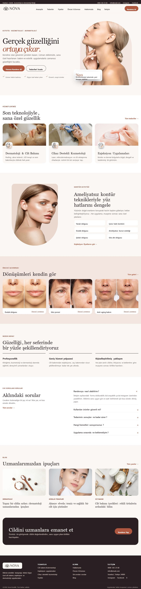
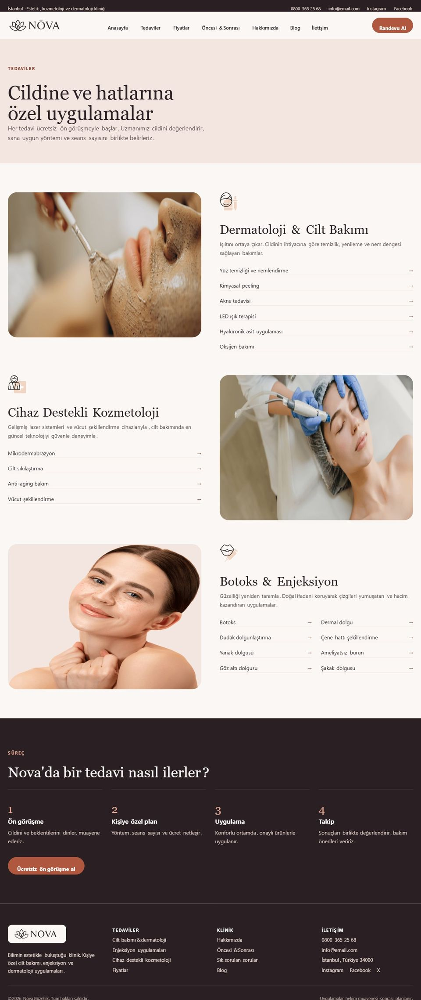
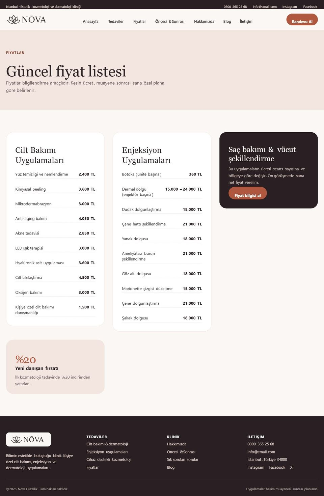
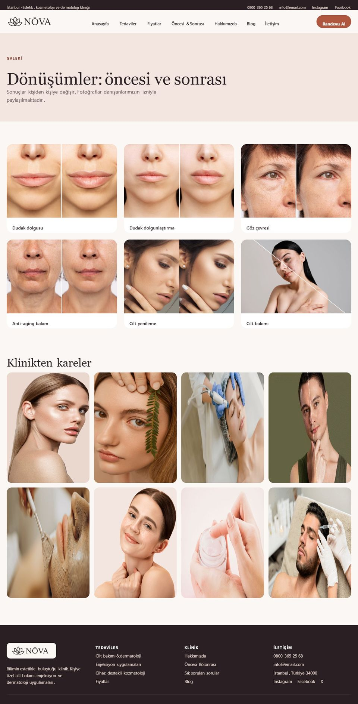
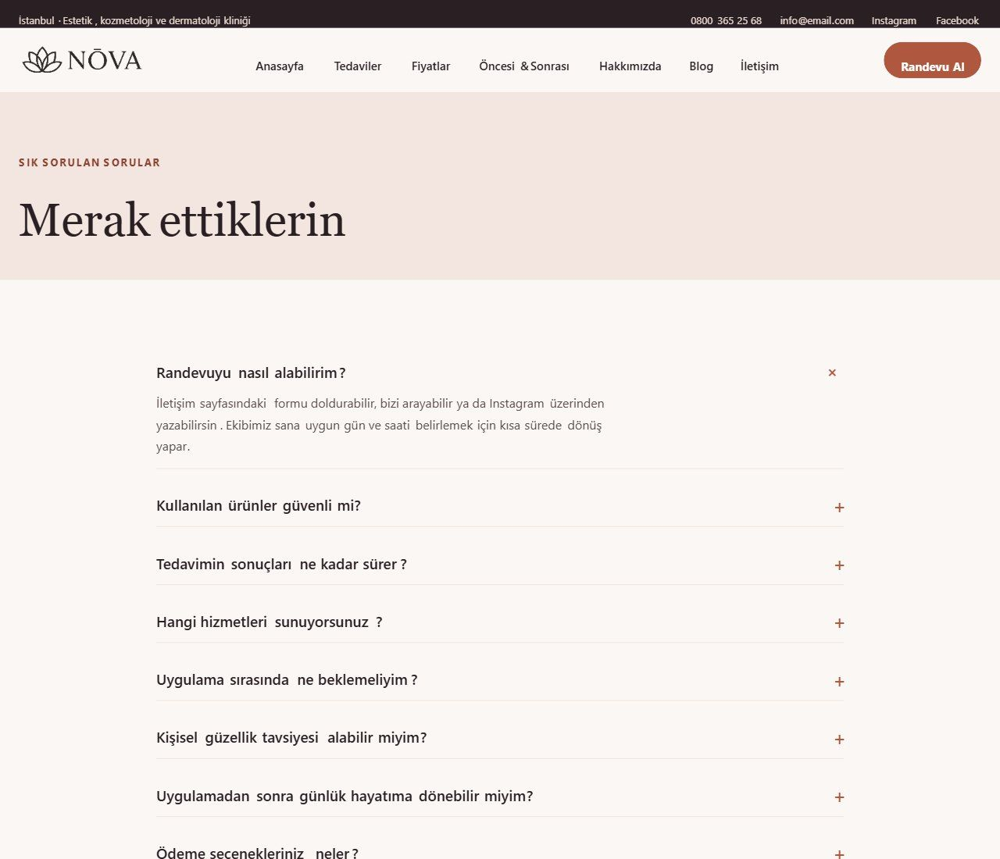
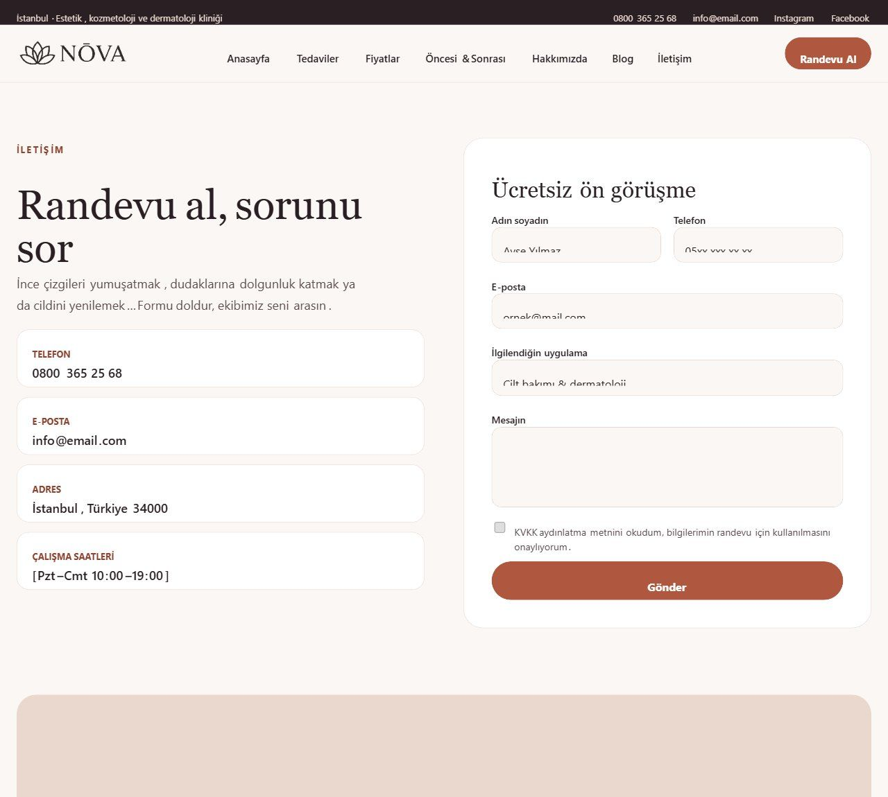
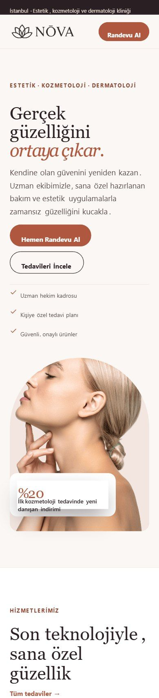

# Nova Güzellik — build a whole site with us

Everything from the video: the mockup, the prompts and the build kit Claude used to turn a blank WordPress into an 8-page clinic site with 6 blog posts — through **FB AI Engine – Claude Connector**, with one approval.

- Video (live build): https://www.youtube.com/watch?v=A6hJy2XQZ34
- Lesson (Türkçe): https://fbsoftwaresolutions.com.tr/tutorials/claude-ve-wordpress-ile-site-yapimi-part-4-bos-wordpresse-tek-onayla-tum-site/

## Screenshots

| Home (full page) | Treatments | Prices |
|---|---|---|
|  |  |  |

| Before & after + gallery | FAQ | Contact | Mobile |
|---|---|---|---|
|  |  |  |  |

Click a picture to see it full size, or open the real pages: download [`mockup/`](mockup/) and open `index.html`.

## What's here

| | |
|---|---|
| [`mockup/`](mockup/) | The approved design — 8 pages as plain HTML. Download the folder and open `index.html` in your browser. |
| [`prompts/1-mockup-prompt.md`](prompts/1-mockup-prompt.md) | Ask Claude to study an old site and design a modern mockup. |
| [`prompts/2-build-kit-prompt.md`](prompts/2-build-kit-prompt.md) | Turn the approved mockup into a build kit. |
| [`prompts/3-build-prompt.md`](prompts/3-build-prompt.md) | Build the site from the kit in a new chat. |
| [`Nova-build-kit.md`](Nova-build-kit.md) | The finished kit: build plan, images, Kadence settings, CSS, form, footer, menu, all pages and posts as WordPress blocks. |

## Make it with us — step by step

1. **Install WordPress** (a test site is fine; a sub-folder like `yoursite.com/test` works too).
2. **Install the connector:** download [fb-claude-connector-1.2.1.zip](https://github.com/fatihborasoftware-sudo/fb-claude-connector/releases/latest) → Plugins → Add New → Upload Plugin → activate.
3. **Claude Connection:** if you see *Fix your links first*, click **Use post-name links**. Setup → **Run server check**. Overview → level **Site maintainer**.
4. **Connect Claude:** Settings → Connectors → Add custom connector → paste the address from Setup (`https://yoursite.com/wp-json/fbsa/v1/mcp`, not the home page) → Connect → **Allow Claude**.
5. **Same site as the video?** Skip to step 7 with our kit. **Your own site?** Run prompt 1, then prompt 2.
6. Approve the mockup in chat; Claude makes your kit and build prompt.
7. **Start a new chat**, attach the kit and paste the build prompt (for Nova: [`prompts/3-build-prompt.md`](prompts/3-build-prompt.md) — first replace `https://fatihbora.net/test` in the kit with your site address).
8. **Approve the build plan once** (Claude Connection → Approvals) and watch it build on **Watch Me Live**.

The Nova pictures are hosted on fbsoftwaresolutions.com.tr for this demo. For a real site, use your own images.

You can also click through the mockup on the lesson page: https://fbsoftwaresolutions.com.tr/tutorials/claude-ve-wordpress-ile-site-yapimi-part-4-bos-wordpresse-tek-onayla-tum-site/

**Türkçe özet:** Videodaki siteyi biz kurduk, sen de aynısını kurabilirsin. Mockup'u tarayıcıda aç, eklentiyi kur, connector'ı bağla, kiti yeni bir sohbete ekleyip 3. prompt'u yapıştır, build planı bir kez onayla — gerisini Claude yapar.
